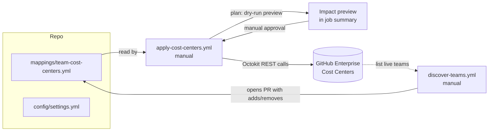

# GitHub Enterprise Cost Center Automation

Manage [GitHub Enterprise Cost Centers](https://docs.github.com/en/enterprise-cloud@latest/rest/billing/cost-centers) from a single, version-controlled mapping of **GitHub teams → cost centers**. All logic calls the GitHub REST API directly via [Octokit](https://octokit.github.io/rest.js/) — there is no dependency on any third-party CLI extension, so the full behavior is in this repository.

> [!IMPORTANT]
> **A user can belong to only one cost center.** GitHub does not allow a single user to be assigned to multiple cost centers. If a user is a member of teams that map to **different** cost centers, the apply step detects this conflict. How it reacts is controlled by the `onConflict` setting in `config/settings.yml`:
> - `stop` (default) — **refuses to run and makes no changes**, exiting with an error that lists the affected user(s) and the conflicting teams. Resolve the conflict (remove the user from all but one of the conflicting teams, or point those teams at the same cost center) before re-running.
> - `defaultCostCenter` — assigns the conflicted user to the configured `defaultCostCenter` and continues (logging a warning).
> - `firstMatch` — assigns the conflicted user to the first cost center detected and continues (logging a warning).
>
> Multiple teams that point at the *same* cost center are always fine; their members are merged.

## How it works

The repository is the source of truth. Two GitHub Actions workflows keep the mapping and the live cost-center membership aligned:



1. **Discovery workflow** (`discover-teams.yml`, manual) — lists every enterprise team and every team in the configured organizations, then diffs them against the mapping file:
   - Teams that exist but are **not yet mapped** are added, defaulting to the configured default cost center.
   - Teams in the mapping that **no longer exist** are removed.
   - Any drift is proposed as a **pull request** for review.
2. **Apply workflow** (`apply-cost-centers.yml`, manual) — manually dispatched from the Actions tab. It runs in two stages with a **manual approval gate** in between:
   - **`plan`** — always runs a dry-run and publishes the impact preview to the job summary: the desired membership of each cost center plus the exact adds/removes that would be made. Nothing is written.
   - **`apply`** — gated by the `cost-centers-apply` environment. It pauses until a required reviewer approves the run, then for each mapping entry it:
     - Resolves the team's current members.
     - Finds the target cost center, **creating it if it does not exist**.
     - Synchronizes membership bidirectionally — adds members missing from the cost center and removes users who are no longer in the team.

   Selecting the `dry-run` input runs only the `plan` stage and skips `apply` entirely.

## Repository layout

| Path | Purpose |
| --- | --- |
| `config/settings.yml` | Enterprise slug, default cost center, organizations to scan. |
| `mappings/team-cost-centers.yml` | Central team → cost-center mapping (source of truth). |
| `src/apply.ts` | Applies the mapping to cost-center membership. |
| `src/discover.ts` | Reconciles the mapping with live teams. |
| `src/lib/github.ts` | Octokit wrappers for the cost-center and team REST endpoints. |
| `src/lib/mapping.ts` | Loads, validates, and serializes the mapping. |
| `src/lib/config.ts` | Loads and validates global settings. |
| `.github/workflows/` | The two workflows described above. |

## Configuration

### `config/settings.yml`

```yaml
enterprise: my-enterprise        # enterprise slug (as in the URL)
defaultCostCenter: Default-Cost-Center
onConflict: stop                 # stop | defaultCostCenter | firstMatch
organizations:                   # orgs scanned by the discovery workflow
  - my-org
```

`onConflict` controls what happens when a user is claimed by more than one cost center:

| Value | Behavior |
| --- | --- |
| `stop` (default) | Report the conflict and abort before any write. |
| `defaultCostCenter` | Assign the user to `defaultCostCenter` and continue. |
| `firstMatch` | Assign the user to the first cost center detected and continue. |

### `mappings/team-cost-centers.yml`

```yaml
teams:
  - type: enterprise             # or: organization
    team: platform-engineering   # team slug
    costCenter: Platform Engineering

  - type: organization
    org: my-org                  # required for organization teams
    team: frontend
    costCenter: Frontend Budget

  - type: organization
    org: my-org
    team: data-science
    # costCenter omitted -> uses defaultCostCenter
```

## GitHub REST API endpoints used

| Operation | Endpoint |
| --- | --- |
| List cost centers | `GET /enterprises/{enterprise}/settings/billing/cost-centers` |
| Get cost center (and its members) | `GET /enterprises/{enterprise}/settings/billing/cost-centers/{id}` |
| Create cost center | `POST /enterprises/{enterprise}/settings/billing/cost-centers` |
| Add users to cost center | `POST /enterprises/{enterprise}/settings/billing/cost-centers/{id}/resource` |
| Remove users from cost center | `DELETE /enterprises/{enterprise}/settings/billing/cost-centers/{id}/resource` |
| List enterprise teams | `GET /enterprises/{enterprise}/teams` |
| List enterprise team members | `GET /enterprises/{enterprise}/teams/{team_slug}/memberships` |
| List organization teams | `GET /orgs/{org}/teams` |
| List organization team members | `GET /orgs/{org}/teams/{team_slug}/members` |

The cost-center endpoints use the `2026-03-10` API version. User mutations are automatically batched (max 50 per request, per GitHub's limit).

## Authentication: PAT and required roles

> [!IMPORTANT]
> The cost-center endpoints **do not work with fine-grained personal access tokens or GitHub App tokens.** You must use a **classic PAT**.

The token's owner must hold a billing-capable role on the enterprise:

- **Enterprise owner** or **Billing manager** — required to read and modify cost centers. (An organization owner can only manage org-scoped resources, which is not sufficient here.)

### Classic PAT scopes

| Scope | Needed for |
| --- | --- |
| `manage_billing:enterprise` | Reading, creating, and updating cost centers and their membership. |
| `read:enterprise` | Listing enterprise teams and their members. |
| `read:org` | Listing organization teams and their members. |
| `repo` | Allows the discovery workflow to push the branch and open the pull request. (A user PAT is used because the built-in `GITHUB_TOKEN` is blocked from creating PRs by default.) |

### Configure the repository secret

1. Create a **classic PAT** with the scopes above, owned by an enterprise owner or billing manager.
2. If your organization or enterprise enforces **SAML SSO**, open the token and **authorize it for the organization** (token page → *Configure SSO* → *Authorize*). Without this, the workflow's git push and API calls fail with `403`.
3. In this repository, go to **Settings → Secrets and variables → Actions → New repository secret**.
4. Name it **`COST_CENTER_PAT`** and paste the token value.

Both workflows read the token from `secrets.COST_CENTER_PAT`. The discovery workflow also opens its pull request with this PAT, so it must include the `repo` scope. (The built-in `GITHUB_TOKEN` is not used for the PR because GitHub blocks Actions from creating pull requests unless explicitly allowed in repository/organization settings.)

## Manual approval gate

The apply workflow will not write any changes until a human approves the run. This is enforced with a GitHub **deployment environment** named `cost-centers-apply`. The `apply` job declares `environment: cost-centers-apply`, so it stays **pending** until a required reviewer approves it — after the `plan` job has published the impact preview.

> [!IMPORTANT]
> You must configure the environment once, or the apply job will run **without** waiting for approval (an environment with no protection rules does not gate anything).

1. In this repository, go to **Settings → Environments → New environment**.
2. Name it exactly **`cost-centers-apply`** and create it.
3. Enable **Required reviewers** and add the user(s) or team(s) allowed to approve an apply. (Optionally set a **wait timer** as well.)
4. Save the protection rules.

To run it: **Actions → Apply cost centers → Run workflow**.
- The `plan` job runs first and writes the **impact preview** (desired membership per cost center plus the planned adds/removes) to the run summary; the same text is also attached as the `cost-center-apply-preview` artifact.
- The `apply` job then shows as **Waiting** and sends the reviewers an approval request. Inspect the preview, then **Approve and deploy** to apply, or **Reject** to make no changes.
- Tick the **dry-run** input to run only the preview and skip the apply stage entirely (no approval needed).

> [!NOTE]
> The preview and the apply are computed in separate jobs, so membership that changes between the preview and the approval is reflected by the apply job re-resolving the mapping at write time. Approve promptly, or re-run if a lot of time passes.

## Running locally

```bash
npm ci

# Preview what the apply step would change (no writes):
GH_TOKEN=<classic-pat> npm run apply -- --dry-run

# Apply the mapping for real:
GH_TOKEN=<classic-pat> npm run apply

# Reconcile the mapping with live teams (writes the YAML file):
GH_TOKEN=<classic-pat> npm run discover

# Type-check:
npm run typecheck
```

## Operational notes

- **One user, one cost center.** GitHub allows a user to belong to only a single cost center. The apply step resolves the *entire* mapping into one `user → cost center` decision before writing anything. If a user is placed in two different cost centers by two different teams, the `onConflict` setting decides the outcome: `stop` (default) **fails and reports the conflict** without making any changes, while `defaultCostCenter` and `firstMatch` auto-resolve it (logging a warning). Multiple teams pointing at the *same* cost center are fine — their members are unioned.
- **Impact preview before every apply.** The apply workflow's `plan` job logs the desired membership of each cost center and the exact adds/removes, then the `apply` job waits for manual approval (see *Manual approval gate*). The same preview is available locally with `npm run apply -- --dry-run`.
- **Adding a team to a cost center** automatically reassigns its members from any previous cost center (per GitHub's API behavior).
- **Bidirectional sync**: membership is computed globally, then each cost center is synced exactly once — users no longer desired in a cost center are removed. Keep the mapping accurate to avoid unintended removals — use `--dry-run` first.
- **Manual dispatch** of the apply workflow supports a `dry-run` input that runs only the preview and skips the apply step (conflicts are reported in dry-run too).
